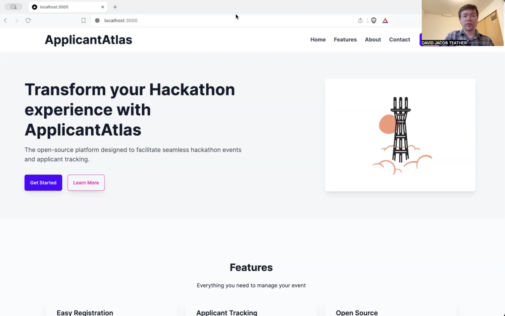

# ApplicantAtlas
A platform made for managing Hackathon applicants &amp; RSVPs and other communications.

Note: This is an ongoing project and some features may not be fully implemented yet.
but if you want to contribute to this project please do :D and if you have any questions feel free to contact me

### Demo

[Demo from March 25th 2024](https://www.youtube.com/watch?v=3shgQ5AY8Zs)

### How to Support The Project
* Star the repo 😎
* Consider [sponsoring](https://github.com/sponsors/applicantatlas) ApplicantAtlas on GitHub
* Send us an email (hello@applicantatlas.com) or a [LinkedIn](https://www.linkedin.com/company/applicantatlas) message telling us what you're using the project for and if there's any additional features you would like to see
* Submit PRs for issues :)

### Documentation

The documentation is available [as markdown](./website/docs/index.md) 
- for developers [here](./website/docs/developers/index.md)
- for self-hosters [here](./website/docs/self-hosters/index.md)
- for event organizers [here](./website/docs/event-organizers/index.md)
- for participants [here](./website/docs/participants/index.md)

### Getting Help

If you have any questions or need help, feel free to open an issue or send us an email at hello@applicantatlas.com